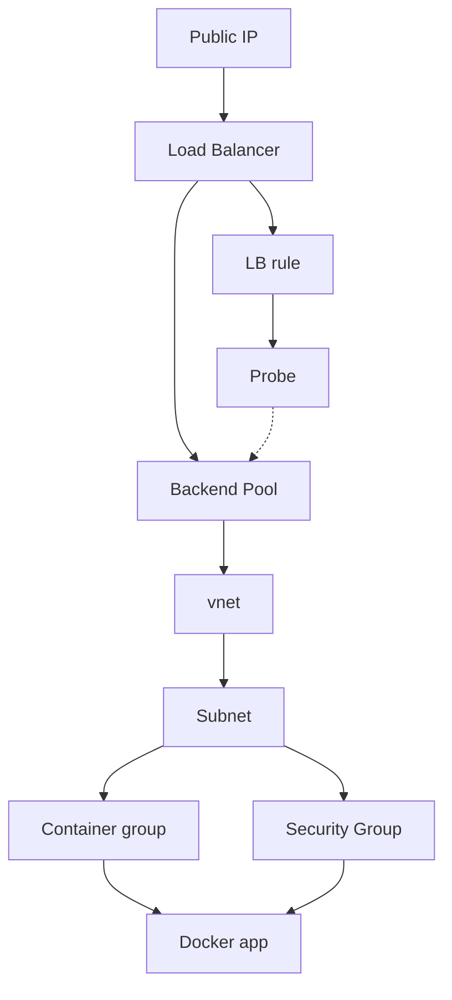

 Running a docker container in Azure private virtual network (vnet) with public access
 The container must be in a manually created vnet if you want to do peering to another
 private network. In this config the subnet gives permission to use blob storage for
 the containe group.

# Design Architecture

